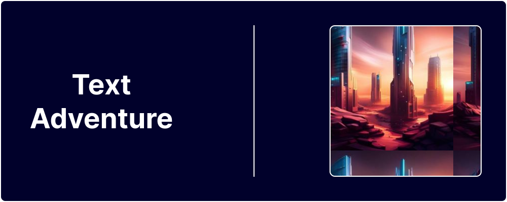
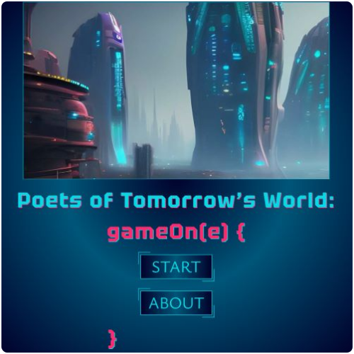
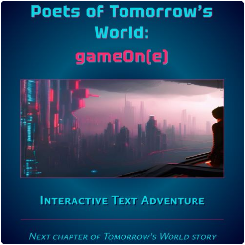
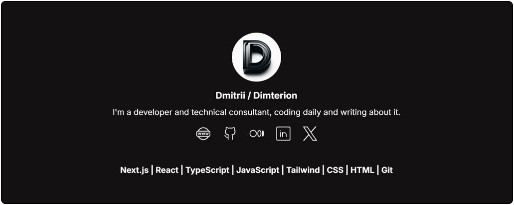

  

# Text Adventure

React / JavaScript game

## 📋 Table of Contents

- [Introduction](#introduction)
- [Features](#features)
- [Screenshots](#screenshots)
- [Tech Stack](#tech-stack)
- [Live Version](#live-version)
- [Contact Info](#contact-info)

## 🔎 Introduction

Poets of Tomorrow’s World: gameOn(e) is an interactive text adventure game that continues the [previous part](https://github.com/Dimterion/PoTW/) of this fictional story.

## 📌 Features

- An interactive story made with React
- Various choices and dialogues to pick from to progress through the story and see different outcomes
- The game is built with React, all styling is done with pure CSS and the project is deployed on Netlify
- It may change in the future as I am adjusting its general design and features as I work on it and see fit
- This is a continuation of the previous text adventure that happens before this one (it can be seen [here](https://github.com/Dimterion/PoTW/))
- More information on how this game has been made can be found on my Medium blog (starting with [this](https://medium.com/@dimterion/making-a-text-adventure-game-7e43df823f80) post)

## 📷 Screenshots

### Home page

**Caption:** Home page that is also a start screen for the game.

### About page

**Caption:** About page with general game description and details.

## ⚙️ Tech Stack

- React
- React Router
- CSS
- Vite
- Prettier
- NightCafe (images generation)
- Netlify

## 🔗 Live Version

### [Text Adventure](https://profound-cat-a609de.netlify.app/)

### [Previous Part](https://poets-of-tomorrows-world.vercel.app/)

## 📫 Contact info

### Bio Link ⬇️

**Note:** Ctrl+Click (Windows/Linux) or Cmd+Click (macOS) the image to open link in a new tab.
